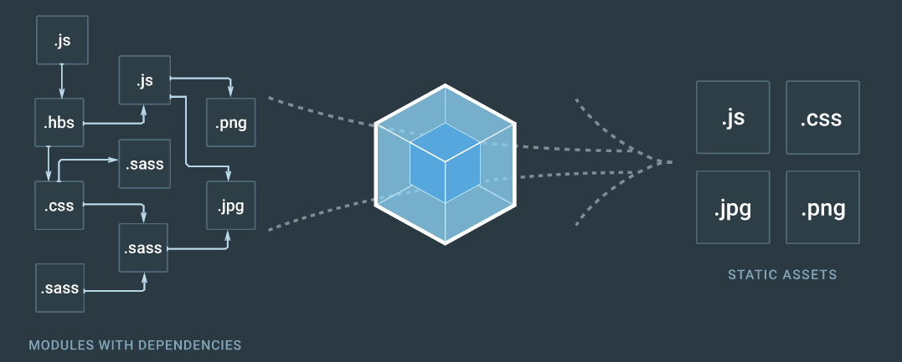

# webpack 基础开发环境

webpack 基础开发环境

## webpack

[webpack](https://webpack.js.org/)是一个模块打包工具,官网有一张很形象的图：


webpack将所有资源（html,js,css,png等等）都视为模块，所以，这里的`模块打包`，指的不仅仅是js的模块。但是，默认情况下，webpack确实只能打包js代码，使用加载器后，方能真正的将其它各种资源视为模块进行打包。

webpack 有四大核心概念：入口、出口、加载器和插件，理解这四个概念很重要，还是认真看看[webpack concepts](https://webpack.js.org/concepts/)

- 为什么要用webpack？

  因为现在的JavaScript已经有了模块的概念，这也意味着JavaScript可以用来写更庞大，更复杂的应用。应用变大了之后，就会面临各模块之间依赖的问题:
  
 - webpack 和 babel的关系
  webpack是一个模块打包的工具，默认是可以识别JavaScript的模块，由于现在浏览器对ES2015 的 import/ export 语法支持还不好,所以webpack会把 import/ export 编译成浏览器能支持的旧版语法，除此之外，对 ES2015 的其它特性，则不会做任何编译（见[webpack ES2015 modules](https://webpack.js.org/guides/getting-started/#es2015-modules)）。
  可以打开`disr/bundle.js`文件看一下,还能找到如`class`等ES2015的语法：
  
  ``` js
  
class BoxManger{
    constructor(){
        ...
    }
    
    init(app){
        ...
    }

    getBox(){
      ...
    }

    changeColor(){
       ...
    }
}

```
这也就意味着，使用ES2015写的代码,浏览器不支持的还是照样不支持。就如这个项目，不支持`class`语法的浏览器就运行不了。

babel则可以把所有这些ES6代码都编译成ES5，以让所有浏览器都能够运行，也可以针对某个具体的运行环境，如chrome，把这个环境不支持的ES6特性编译成ES5.


## 项目结构

|文件及目录|说明|
|---|---|
|dist|webpack打包后放置的文件夹|
|doc|放置文档相关的东西|
|src|放置源码，全部是js，html和css手动移到了dist目录下|
|package.json|npm配置|
|webpack.config.js|webpack配置，里面只配了入口和出口两项|

## 使用项目

1、 首先安装依赖

```text
npm install 
```

2、运行webpack打包js
```text
npm start
```